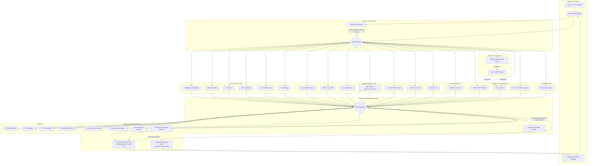

# Deployment Assist Tool (DAT) Architecture

DAT is a robust, massively parallelized Polyglot DevSecOps orchestration CLI and platform. It wraps the industry's best open-source scanners into a single, cohesive CI/CD pipeline, fully equipped with an autonomous code remediation engine.

## System Architecture

## Core Components
0. **Application Component Model (`src/components/`):** *(Phase 2)* Builds a typed graph of what the application is made of — `Button`/`Input`/`Form`/`ApiCall` (React/JSX), `ApiEndpoint` (Express/Fastify/Next), and `NetworkResource` (Terraform) — and links client API calls to the backend endpoints they hit. Persisted via `dat model` or `scan --component-model`; findings are attributed to components (`componentRef`) in the fix manifest. This is the foundation for per-component fail-safe/robustness evaluation (Phase 3). See [COMPONENT_MODEL.md](COMPONENT_MODEL.md).
1. **Dynamic Environment Detector (`src/env.ts`):** Scans the workspace to identify the exact ecosystems present (`package.json`, `requirements.txt`, `go.mod`, etc.) and dynamically prunes unused scanners to optimize performance.
2. **Execution Runner (`src/runner.ts`):** Safely spawns child processes for external tools with concurrency pooling, timeout handling, and `ENOENT` interception.
3. **Polyglot Reachability Engine (`src/reachability/`):** Cross-references standard SCA vulnerabilities with **regex/import-heuristic** source analysis (true AST/call-graph reachability is planned — see roadmap). It scans import/use declarations across Node, Python, Java, C#, and Rust to flag whether a vulnerable dependency is referenced in the application tree, cutting false positives. It deliberately *fails open* (treats a package as reachable on any analysis error) so a heuristic miss never suppresses a real CVE.
4. **Agentic & AST Remediation Engine (`src/autofix/` & `src/llm/`):** Moves DAT beyond "reporting" to "fixing". It leverages deterministic AST rewrites (`ast-grep`) and LLMs (Google Gemini) to automatically patch logical flaws and rewrite vulnerable `Dockerfiles` into distroless bases.
5. **Test-Driven Rollback Loop:** A critical safety net that executes the native testing framework (`npm test`, `pytest`, `cargo test`) immediately after an auto-fix. If the tests fail, the engine uses Git to silently revert the broken code before any human sees it.
6. **Native Event Listener (`src/app.ts`):** Probot/Octokit infrastructure allowing organizational 1-click install and webhook-driven executions. It works with the **Self-Healing PR Bot (`src/agent/`)** to branch, commit, and open PRs for remediated vulnerabilities completely autonomously.
7. **Ephemeral Deployment Engine (`src/deployers/`):** Dynamically spins up and tears down live preview branches using Vercel/AWS APIs to run DAST and load tests securely against untrusted PR code.
8. **Result Aggregator (`src/types.ts`):** Normalizes the widely varying JSON structures of 20+ scanning tools into a single, predictable `Issue[]` array.
9. **Quality Gate Engine:** Evaluates the mathematically calculated `Deployment Readiness Score` against configured `failOn` thresholds to enforce strict exit codes and block insecure deployments.